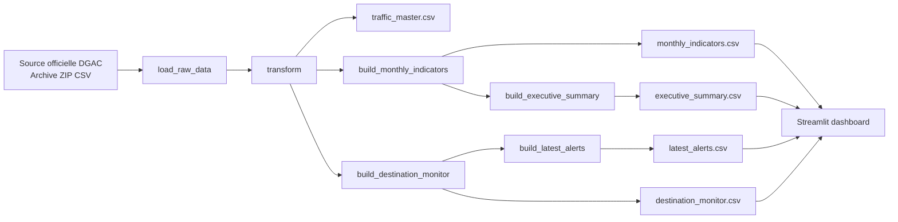
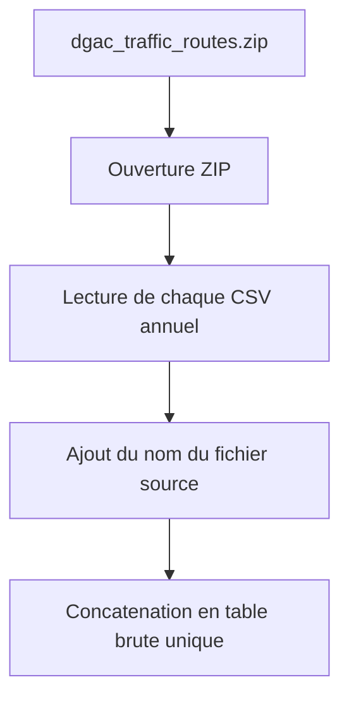
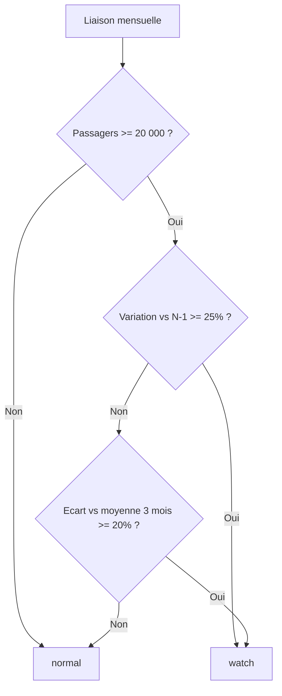
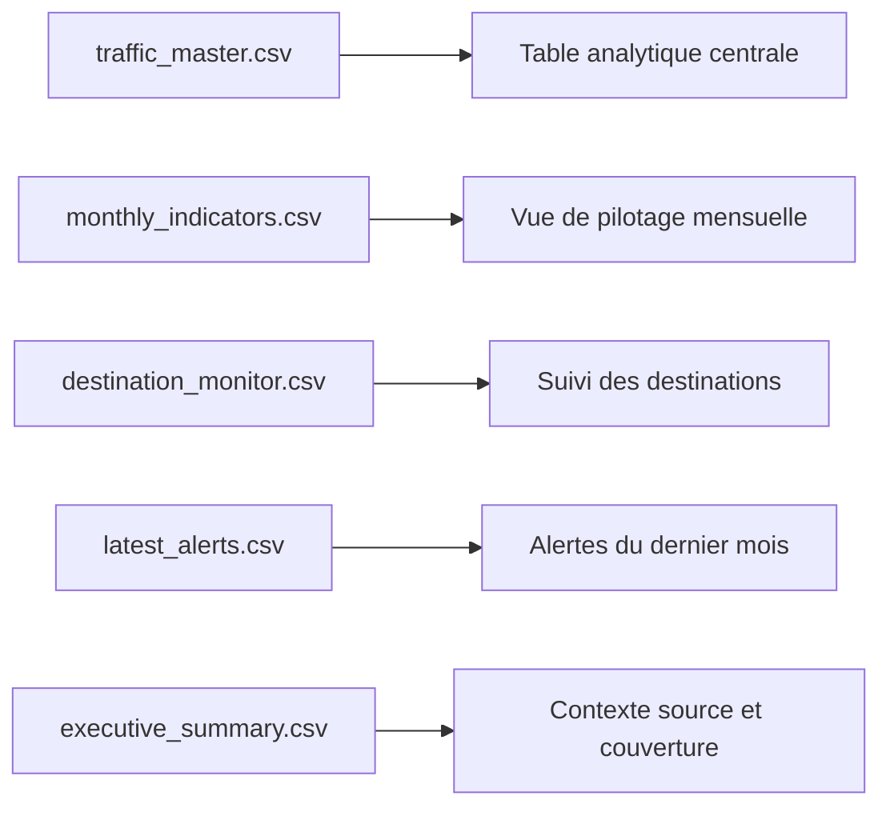
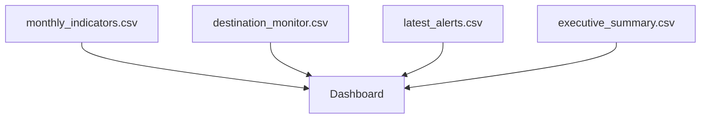

# DGAC Traffic Intelligence

Projet de monitoring du trafic aerien commercial construit a partir d'une source ouverte officielle publiee par la DGAC sur `data.gouv.fr`.

L'objectif de ce projet est de montrer une demarche d'ingenierie des donnees complete :

- ingestion d'une source institutionnelle reelle
- ETL Python sur plusieurs fichiers historiques
- production d'indicateurs mensuels de pilotage
- mise sous surveillance de liaisons a variation atypique
- restitution metier dans une application Streamlit

## Resume Executif

Ce projet part d'une archive ZIP officielle de la DGAC contenant l'historique mensuel du trafic aerien commercial francais par liaison.

Le pipeline :

1. charge les fichiers CSV annuels,
2. les normalise dans une table analytique unique,
3. calcule des indicateurs mensuels,
4. identifie des liaisons a surveiller selon des regles simples,
5. restitue les resultats dans un dashboard lisible.

Pour un recruteur, ce projet permet de voir rapidement que je sais :

- travailler a partir d'une vraie source publique,
- structurer un ETL propre en Python,
- produire des tables analytiques reutilisables,
- transformer des donnees brutes en indicateurs decisionnels,
- expliquer clairement une logique metier.

## Chiffres Cles

Les chiffres ci-dessous correspondent aux sorties actuellement generees dans `data/processed/`.

| Indicateur | Valeur |
|---|---:|
| Dernier mois disponible | `2024-12` |
| Periode couverte | `1990-2024` |
| Enregistrements de liaisons mensuelles | `44 194` |
| Segment international + national | `2` |
| Passagers sur le dernier mois | `13 478 650` |
| Vols directs sur le dernier mois | `114 046` |
| Destinations suivies sur le dernier mois | `103` |
| Liaisons en veille sur le dernier mois | `16` |

## Source De Donnees

- Producteur : Direction Generale de l'Aviation Civile
- Jeu de donnees : `Trafic aerien commercial mensuel francais par paire d'aeroports par sens depuis 1990`
- Portail : [data.gouv.fr](https://www.data.gouv.fr/datasets/trafic-aerien-commercial-mensuel-francais-par-paire-daeroports-par-sens-depuis-1990/)
- Ressource utilisee dans le projet : archive ZIP DGAC
- Mise a jour de la ressource utilisee : `2026-01-07`

Le fichier source est stocke localement dans `data/raw/dgac_traffic_routes.zip`.

## Vision D Ensemble



Ce schema montre que le projet est organise comme une petite chaine data :

- une couche `source`,
- une couche `transformation`,
- une couche `tables finales`,
- une couche `restitution`.

## Ce Que Fait Le Pipeline

### 1. Ingestion

Le pipeline ouvre l'archive ZIP officielle DGAC et concatene tous les CSV annuels dans une seule table brute.



Ce point est important parce qu'il montre que le projet ne repose pas sur un CSV isole, mais sur un historique multi-fichiers.

### 2. Transformation Et Nettoyage

Le pipeline normalise ensuite les donnees pour les rendre analysables :

- conversion du champ `ANMOIS` en vraie date,
- conversion des nombres ecrits avec virgule en format numerique,
- gestion des valeurs manquantes,
- suppression des lignes d'agregation globale peu utiles pour un suivi liaison par liaison,
- creation de colonnes plus lisibles comme `segment_label`, `origin_zone`, `destination`, `passengers`, `direct_flights`.


L'objectif n'est pas seulement de "nettoyer", mais de produire une base analytique comprensible par un utilisateur non technique.

### 3. Construction Des Indicateurs

Le projet construit deux niveaux d'analyse :

- une vue mensuelle par segment de trafic,
- une vue de monitoring par destination.

#### Vue mensuelle

La table `monthly_indicators.csv` regroupe :

- le nombre de passagers,
- les unites commerciales,
- les vols directs,
- le nombre de destinations,
- l'evolution en pourcentage par rapport au meme mois de l'annee precedente.

#### Vue par destination

La table `destination_monitor.csv` permet de suivre l'evolution de chaque destination recente.

Elle calcule notamment :

- les passagers du mois,
- les vols directs du mois,
- la variation `vs N-1`,
- l'ecart a la moyenne glissante sur `3 mois`.

## Logique D Alerte

Le projet ne cherche pas a faire de prevision avancee. Il met en place une logique simple, lisible et defendable de surveillance.

Une liaison est mise en `watch` si :

- le volume est suffisamment significatif,
- et qu'il existe une variation forte par rapport a `N-1`,
- ou un ecart important par rapport au rythme recent.



Cette logique a ete choisie volontairement :

- elle est simple a expliquer,
- elle est interpretable,
- elle est adaptee a une demonstration de pipeline data,
- elle peut ensuite etre remplacee ou completee par des modeles plus avances.

## Fichiers Produits



### `traffic_master.csv`

Table centrale issue du nettoyage et de la transformation.

Elle contient notamment :

- la date,
- le segment,
- la zone d'origine,
- la destination,
- le continent de destination,
- les passagers,
- les vols directs.

### `monthly_indicators.csv`

Vue de pilotage synthetique pour repondre a des questions du type :

- comment evolue le trafic dans le temps ?
- quelle est la dynamique du trafic national vs international ?
- combien de destinations sont actives sur une periode donnee ?

### `destination_monitor.csv`

Vue la plus utile pour le monitoring.

Elle permet de repondre a des questions du type :

- quelles destinations progressent fortement ?
- quelles destinations reculent fortement ?
- quelles destinations sortent du rythme recent ?

### `latest_alerts.csv`

Table courte et exploitable qui isole les liaisons a surveiller sur le dernier mois disponible.

### `executive_summary.csv`

Table de contexte qui rappelle :

- la source,
- la date de mise a jour de la source,
- le dernier mois disponible,
- la periode couverte.

## Ce Que Montre Le Dashboard

L'application Streamlit s'appuie directement sur les tables generees par le pipeline.

Elle affiche :

- des tuiles de synthese sur le dernier mois,
- une courbe d'evolution mensuelle du trafic,
- un classement des destinations dominantes,
- un tableau des liaisons a surveiller.



L'objectif du dashboard n'est pas d'etre un produit final, mais de rendre visibles les resultats du pipeline dans une logique metier.

## Structure Du Projet

| Fichier / dossier | Role |
|---|---|
| `src/airsafety_ai/pipeline.py` | Pipeline ETL principal et calcul des indicateurs |
| `app.py` | Application Streamlit de restitution |
| `data/raw/dgac_traffic_routes.zip` | Source officielle DGAC |
| `data/processed/traffic_master.csv` | Table analytique centrale |
| `data/processed/monthly_indicators.csv` | Indicateurs mensuels |
| `data/processed/destination_monitor.csv` | Suivi par destination |
| `data/processed/latest_alerts.csv` | Alertes du dernier mois |
| `data/processed/executive_summary.csv` | Resume de contexte |

## Lecture Rapide Du Code

### `load_raw_data()`

Charge l'archive ZIP officielle et assemble les CSV annuels.

### `transform()`

Nettoie les colonnes DGAC brutes et cree une table analytique lisible.

### `build_monthly_indicators()`

Construit la vue mensuelle de pilotage.

### `build_destination_monitor()`

Construit la vue de suivi des destinations et calcule les variations.

### `build_latest_alerts()`

Extrait les alertes du dernier mois disponible.

### `build_executive_summary()`

Ajoute le contexte de source et de couverture temporelle.

### `app.py`

Consomme les tables finales pour les restituer dans une interface simple.

## Comment Lancer Le Projet

```bash
source .venv/bin/activate
pip install -r requirements.txt
python -m src.airsafety_ai.pipeline
streamlit run app.py
```

## Ce Que Ce Projet Permet De Valoriser

Ce projet montre ma capacite a :

- manipuler une vraie source open data institutionnelle,
- concevoir un pipeline ETL Python structurant,
- produire des donnees propres pour la BI,
- transformer des fichiers bruts en indicateurs de pilotage,
- construire une logique simple de monitoring,
- restituer les resultats de facon lisible pour un usage metier.

## Limites Assumees

Le projet reste un prototype realiste, pas un produit industriel complet.

Les principales limites sont :

- la source est ouverte et deja agregee,
- il n'y a pas d'orchestration planifiee dans cette version,
- les regles d'alerte sont volontairement simples et interpretables,
- le dashboard est une couche de demonstration plus qu'un outil final.

## Pitch Court

"J'ai construit un mini-projet de monitoring a partir d'une source ouverte officielle de la DGAC sur le trafic aerien commercial. J'ai integre plusieurs fichiers historiques dans un pipeline Python, normalise les donnees, calcule des indicateurs mensuels et mis sous surveillance les liaisons presentant des evolutions atypiques. L'objectif etait de montrer une demarche d'ingenierie des donnees realiste, reproductible et orientee usage metier."
